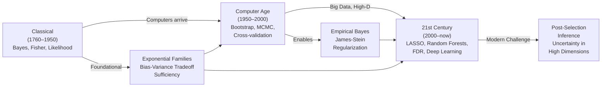

> 📄 **[Read the Full Book](/papers-hosted/casi.pdf){target="_blank"}**

## The Gist

This isn't a research paper — it's a *map*. "Computer Age Statistical Inference" (Efron & Hastie, Cambridge University Press, 2016/2021) is the definitive account of how statistical thinking evolved from hand-computation to the algorithmic era. Written by two of the field's architects — Bradley Efron (inventor of the bootstrap) and Trevor Hastie (co-creator of LASSO, GAMs, and "The Elements of Statistical Learning") — the book traces 250 years of inference theory and practice.

The book spans 21 chapters across three parts:

- **Part I (Classical Inference):** Bayesian methods, frequentist foundations, Fisher's synthesis, maximum likelihood estimation, and exponential families.
- **Part II (Early Computer Age):** Empirical Bayes, James-Stein estimation, GLMs, survival analysis, bootstrap, jackknife, cross-validation, and MCMC.
- **Part III (21st Century):** False discovery rates, LASSO, random forests, boosting, neural networks, SVMs, and post-selection inference.

Written for master's and first-year PhD students, yet remarkably accessible even for practitioners without deep mathematical background. The level is *graduate*, but the clarity is exceptional.

## Why Read This Now?

In an era where machine learning practitioners often skip statistical foundations, this book does something rare: it shows that modern methods aren't magic tricks — they're *inevitable extensions* of classical inference. Neural networks, random forests, regularization, cross-validation — these emerged naturally from statistical thinking meeting computational possibility.

Two reasons this matters:

1. **You become a better practitioner.** Understanding the lineage of methods changes how you use them. You stop cargo-culting hyperparameter tuning and start reasoning about bias-variance tradeoffs. You understand why LASSO works, not just that it does.

2. **The algorithms vs. inference distinction is more relevant than ever.** As LLMs and large models dominate, distinguishing between "we can compute this" and "we can trust this" becomes critical. This book is your guide to that distinction.

## The Three Eras

### Part I: Classical Foundations (Chapters 1–7)

The book opens with Bayes' theorem and traces forward. Efron and Hastie show how Bayes, frequentist, and Fisher's approaches aren't competing systems but *complementary perspectives*. Exponential families emerge as a unifying language. The math here is real, but the intuition is always kept in view.

| Chapter | Key Concept | Why It Matters |
|---------|-------------|----------------|
| 1–2 | Bayes, likelihood, frequentist logic | The foundations. Nothing here is outdated. |
| 3 | Fisher and sufficiency | Fisher's genius at recognizing which statistics matter. |
| 4 | Exponential families | The deep structure underlying nearly all statistical models. |
| 5–7 | Hypothesis testing, confidence intervals, Bayesian credible sets | How inference claims are actually made. |

### Part II: What Computers Made Possible (Chapters 8–16)

This is where the book shines. Computers didn't replace statistical theory — they *liberated* it. Analytical solutions gave way to algorithmic ones. The bootstrap replaces the delta method. MCMC approximates intractable posteriors. Cross-validation bypasses the Cramer-Rao bound.

| Chapter | Key Concept | Revolutionary Because |
|---------|-------------|----------------------|
| 8 | Bootstrap & jackknife | No more analytical standard errors; just resample. |
| 9 | Cross-validation & model selection | Empirical error rates beat theoretical bounds. |
| 10 | Maximum likelihood in the computer age | Algorithms like Newton-Raphson become practical. |
| 11–13 | GLMs, survival analysis, logistic regression | Extensions that follow naturally from exponential families. |
| 14 | Empirical Bayes | Frequentist and Bayesian: not enemies, partners. |
| 15 | MCMC & simulation | Intractable becomes computable. |
| 16 | Smoothing & GAMs | Flexible fitting without overfitting (if you're careful). |

### Part III: The Modern Frontier (Chapters 17–21)

Where inference meets the data tsunami. Sparse methods (LASSO, elastic net), ensemble methods (random forests, boosting), and neural networks. The challenge: high-dimensional data breaks classical assumptions. The response: new inference frameworks.

| Chapter | Key Concept | The Challenge |
|---------|-------------|----------------|
| 17 | False discovery rate (FDR) | Multiple testing in the high-dimensional regime. |
| 18 | LASSO & sparse methods | Fitting p > n problems. Regularization as inference. |
| 19 | Random forests & boosting | Ensemble methods that work, but are hard to interpret. |
| 20 | Neural networks | Deep learning from a statistical lens. |
| 21 | Inference after selection | Using the same data for model selection and inference? Here's how. |

## The Flow of Innovation



## The Big Ideas

Four threads tie the entire book together:

### 1. The Bootstrap as Computer-Age Standard Errors

Efron's bootstrap is more than a computational trick — it's a philosophical reframing. Instead of *deriving* the standard error analytically, you *estimate* it empirically by resampling. For any estimator, any distribution. This is the computer replacing calculus.

**Example:** Want the standard error of the median? Fisher says it's intractable for most distributions. Efron says: resample 10,000 times, compute the median each time, take the standard deviation. Done.

### 2. Empirical Bayes as the Frequentist-Bayesian Bridge

The classical split: Bayesians specify priors (subjective), frequentists don't (objective). Empirical Bayes says: estimate the prior *from the data* itself. Suddenly, frequentist methods look Bayesian, and Bayesian methods look frequentist. The boundary blurs.

**Example:** Estimating baseball player batting averages. Rare players have noisy estimates. Empirical Bayes shrinks rare players' averages toward the population mean — automatically, without specifying a prior by hand.

### 3. The Bias-Variance Tradeoff as the Organizing Principle

Every method in this book — from ridge regression to random forests — is a solution to the bias-variance tradeoff. More flexibility means lower bias but higher variance. Regularization, ensemble averaging, cross-validation — they're all strategies for finding the sweet spot.

**Insight:** Modern ML's obsession with "generalization" is really just the bias-variance tradeoff in new clothing.

### 4. The Inference Crisis in High Dimensions

When p > n (features exceed samples), classical inference breaks. Standard errors explode. Model selection becomes data snooping. FDR, post-selection inference, and regularized methods are all responses to this crisis. The book doesn't pretend there's a perfect solution — just honest tools for a hard problem.

## Rubber-Ducking the Jargon

If the terminology feels thick, here's a translation:

- **MLE (Maximum Likelihood Estimation):** Find the parameter values that make the data you observed most likely. The dominant inference method for 200+ years.
- **Exponential family:** A mathematical family of distributions with special properties: conjugate priors, sufficient statistics, natural parameter space. Nearly all standard models belong here.
- **Empirical Bayes:** Use the data itself to estimate the prior, then apply Bayes' rule. Bridges frequentist and Bayesian thinking.
- **James-Stein estimation:** A counterintuitive result: under squared-error loss, shrinking estimates toward a central value beats plain MLEs in high dimensions. Still weird and wonderful after 60 years.
- **Bootstrap:** Resample your data (with replacement) many times, compute your statistic each time, use the distribution of those replicates to estimate the standard error. Works for *any* statistic, any distribution.
- **False Discovery Rate (FDR):** Instead of controlling the probability of any false positive (like traditional multiple testing correction), control the *expected proportion* of false positives among those you call "significant." Much less conservative, more powerful.
- **LASSO (Least Absolute Shrinkage and Selection Operator):** Regularize regression by penalizing the sum of absolute coefficients. Drives weak coefficients to exactly zero. Solves the p > n problem.
- **Post-Selection Inference:** After selecting a model (say, LASSO picked 10 variables), can you still make valid confidence intervals for those variables? Yes — but it's tricky and the book shows how.

## What to Watch Out For

The book is brilliant, but it has limits worth knowing:

1. **Published 2016 (corrected 2021), so deep learning coverage is thin.** Chapters 20 discusses neural networks, but it reads as "neural networks are back and we don't fully understand them yet." For modern deep learning intuition, you'll need other sources. The statistical *principles* still apply, but the specifics have moved fast.

2. **Assumes mathematical maturity.** You need comfort with probability, linear algebra, and multivariable calculus. The book is clear, but it doesn't stop to re-teach calculus. Suitable for graduate students and self-taught practitioners with solid math backgrounds.

3. **Some chapters are dense.** Parts of Chapters 4 (exponential families), 14 (empirical Bayes), and 21 (post-selection inference) are technical. Skim on first read, revisit when needed.

4. **Better as a second exposure than a first.** If you're new to statistics entirely, start with "Statistical Rethinking" or "The Elements of Statistical Learning" first. This book assumes you've seen hypothesis testing and linear regression before. It's the book you read to understand *why* those things work.

## So What?

If you want to understand *why* modern ML methods work — not just *how to use* them — this is the book. It's especially valuable for:

- Data scientists who learned ML first and statistics second (this fills the gap)
- Machine learning engineers wondering why regularization matters (it's the bias-variance tradeoff)
- Statisticians transitioning to the "big data" era (here's how classical thinking evolves)
- Researchers in high-dimensional settings (false discovery rate, post-selection inference)

Reading this book changes your mental model. You stop seeing methods as isolated tricks and start seeing them as solutions to fundamental problems. That shift in thinking is worth the dense chapters.

## Reproduction & Implementation

The book includes many algorithms and examples. Here are a few you can implement yourself to cement understanding:

### Bootstrap Example (Python)

```python
import numpy as np
from scipy import stats

# Data: observed measurements
data = np.array([3.2, 4.1, 3.8, 4.5, 3.9])

# Bootstrap
n_bootstrap = 10000
bootstrap_medians = []
for _ in range(n_bootstrap):
    resample = np.random.choice(data, size=len(data), replace=True)
    bootstrap_medians.append(np.median(resample))

# Standard error of the median
se_median = np.std(bootstrap_medians)
print(f"Bootstrap SE of median: {se_median:.4f}")
```

### LASSO Regression (Python)

```python
from sklearn.linear_model import Lasso
import numpy as np

# Generate high-dimensional data (p > n)
n, p = 50, 200
X = np.random.randn(n, p)
true_beta = np.zeros(p)
true_beta[:10] = np.random.randn(10)
y = X @ true_beta + np.random.randn(n) * 0.1

# LASSO with cross-validation
from sklearn.linear_model import LassoCV
model = LassoCV(cv=5).fit(X, y)
selected = np.where(model.coef_ != 0)[0]
print(f"LASSO selected {len(selected)} variables")
```

### Cross-Validation (Python)

```python
from sklearn.model_selection import cross_val_score
from sklearn.linear_model import LogisticRegression
from sklearn.datasets import load_breast_cancer

X, y = load_breast_cancer(return_X_y=True)
model = LogisticRegression()
scores = cross_val_score(model, X, y, cv=5, scoring='accuracy')
print(f"Cross-validation accuracy: {scores.mean():.3f} +/- {scores.std():.3f}")
```

## Resources

- **Book**: [Computer Age Statistical Inference (Full PDF)](/papers-hosted/casi.pdf) | [Cambridge University Press](https://www.cambridge.org/us/academic/subjects/statistics-probability/statistical-theory-and-methods/computer-age-statistical-inference-algorithms-evidence-and-data-science)
- **Supplementary materials:** [Statistics Department, Stanford University](https://web.stanford.edu/~hastie/CASI/)
- **R code:** The book has an accompanying R package and code examples
- **Related reading:**
  - "The Elements of Statistical Learning" (Hastie, Tibshirani, Friedman) — more applied, with detailed algorithms
  - "An Introduction to Statistical Learning" (James, Witten, Hastie, Tibshirani) — more gentle introduction
  - "Statistical Rethinking" (McElreath) — Bayesian approach to modern inference
