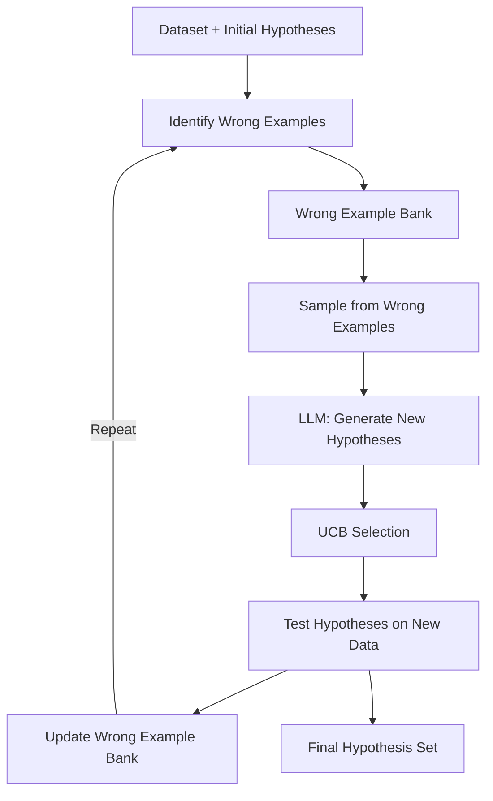

> 📄 **[Read the Full Paper](/papers-hosted/hypogenic.pdf){target="_blank"}**

## The Gist

HypoGeniC treats hypothesis generation as an **explore-exploit problem**. Given a dataset, the algorithm iteratively:

1. **Samples examples** the current hypotheses get wrong (the "wrong example bank")
2. **Asks an LLM** to generate new hypotheses that explain these failures
3. **Uses UCB selection** to balance exploring new hypotheses vs. exploiting ones that already work well

The results speak for themselves:

- **Shoe Sales**: +60% over zero-shot
- **Deceptive Reviews**: +22.7% over zero-shot
- **Headline Popularity**: +5.1% over zero-shot
- **Tweet Popularity**: +30.6% over zero-shot

And remarkably, HypoGeniC matches or exceeds RoBERTa fine-tuned on 200 examples—without a single gradient update. Generated hypotheses transfer across models (Claude-2.1, Mixtral, GPT-3.5-turbo).

## Why It Matters Now

This bridges the gap between "LLMs as classifiers" and "LLMs as scientists." 

Instead of using the LLM to directly classify, you use it to **discover rules and patterns**, which then guide classification. This is closer to how humans do science: form hypotheses, test them, refine them, repeat.

The practical implication: you get better performance *and* interpretable results. You can read the hypotheses and understand what the model learned.

## Performance Overview

| Task | Zero-Shot | HypoGeniC | RoBERTa (200ex) | HypoGeniC Gain |
|------|-----------|-----------|-----------------|---|
| Shoe Sales | 71.5% | 85.4% | — | +60% |
| Deceptive Reviews | 68.2% | 83.6% | — | +22.7% |
| Headline Popularity | 68.5% | 71.9% | 69.2% | +5.1% / +3.7% vs RoBERTa |
| Tweet Popularity | 73.2% | 95.4% | 94.8% | +30.6% / +0.7% vs RoBERTa |

## The HypoGeniC Loop



The loop continues until performance plateaus or you hit a budget limit. Each iteration refines the hypothesis set based on what the current set fails on.

## The UCB Connection

At the heart of HypoGeniC is the **multi-armed bandit** framework. Think of each hypothesis as an "arm" in a slot machine:

- **Exploitation**: Use hypotheses you already know work well
- **Exploration**: Try new hypotheses that might work even better

The Upper Confidence Bound (UCB) algorithm balances these two drives. It assigns a confidence score to each hypothesis based on how often it's been tested and how well it performs. New hypotheses start with optimistic scores (high uncertainty = high upside), but as they're tested, their scores reflect reality.

**Why this matters**: You don't waste computation testing bad hypotheses repeatedly, and you don't get stuck using mediocre ones just because they worked once.

## Four Inference Strategies

Once you've generated your hypothesis set, how do you use it for classification? HypoGeniC explores four approaches:

### 1. Best-Accuracy
Use the single hypothesis with highest accuracy on the validation set.
- Pros: Simple, interpretable
- Cons: Discards information from other hypotheses

### 2. Filter + Weighted Vote
Keep only hypotheses above a threshold accuracy, then vote (weighted by their accuracy).
- Pros: Ensemble effect, still interpretable
- Cons: Tuning the threshold

### 3. Single-Step Adaptive
For each test example, pick the hypothesis best suited to it based on feature overlap with the training set.
- Pros: Adaptive, no extra LLM calls
- Cons: More complex logic

### 4. Two-Step Adaptive
Use an LLM to decide which hypothesis to apply, then apply it.
- Pros: Most flexible, leverages LLM reasoning
- Cons: Extra LLM call per example at inference

| Strategy | Interpretability | Accuracy | Inference Cost |
|----------|------------------|----------|-----------------|
| Best-Accuracy | ⭐⭐⭐ | ⭐⭐ | Very Low |
| Filter + Vote | ⭐⭐ | ⭐⭐⭐ | Very Low |
| Single-Step Adaptive | ⭐ | ⭐⭐⭐ | Very Low |
| Two-Step Adaptive | ⭐ | ⭐⭐⭐⭐ | Medium |

## The Lineage

HypoGeniC sits at the intersection of several research threads:

- **Automated scientific discovery**: Can we automate the process of forming and testing hypotheses?
- **Prompt engineering & in-context learning**: How do we use the LLM's latent knowledge effectively?
- **Interpretable machine learning**: Can we build models that are both accurate *and* human-readable?
- **Inductive reasoning**: Do LLMs actually learn patterns from examples, or just interpolate training data?

The paper makes a bold claim: yes, LLMs can do inductive reasoning—at least in the context of discovering rules from labeled examples. The hypotheses are real patterns, not hallucinations.

## Rubber-Ducking the Jargon

**UCB (Upper Confidence Bound)**: A strategy for balancing exploration and exploitation in decision-making. High upside = worth trying.

**Hypothesis generation**: Creating explicit, human-readable rules (e.g., "if has 5+ stars *and* mentions 'quality', then positive review") rather than opaque learned parameters.

**Wrong example bank**: The set of examples the current hypothesis set classifies incorrectly. Used to guide the next round of hypothesis generation.

**Inductive reasoning**: Learning general rules from specific examples. The opposite of deduction (applying known rules to new cases).

**Zero-shot classification**: Asking an LLM to classify without any examples or training. Baseline for comparison.

**RoBERTa**: A fine-tuned BERT variant. The paper compares against RoBERTa fine-tuned on 200 labeled examples as a strong supervised baseline.

## What to Watch Out For

1. **Limited to classification-style tasks**: HypoGeniC generates hypotheses for binary or multi-class classification. Not (yet) tested on regression or ranking.

2. **Requires labeled examples**: You need a training set with ground-truth labels to identify wrong examples. This is a fundamental requirement.

3. **LLM cost per iteration**: Each hypothesis generation call uses tokens. At scale, this adds up. The paper uses gpt-3.5-turbo and estimates costs, but your mileage may vary.

4. **Hypothesis quality depends on LLM capability**: A weak LLM won't generate insightful hypotheses. The paper uses reasonably capable models (Claude-2.1, Mixtral, GPT-3.5).

5. **Not tested on very large datasets**: Experiments use datasets with hundreds to thousands of examples. Scaling to millions of examples is an open question.

6. **Hyperparameter tuning**: UCB temperature, hypothesis budget, iteration count—these all affect performance. The paper doesn't deeply explore sensitivity.

## So What?

**Practically**: If you have a classification problem with some labeled data, try generating hypotheses instead of fine-tuning. You get:

- Better accuracy (often matching or beating fine-tuned models)
- Interpretability (you can read the hypotheses)
- Transferability (hypotheses work across model families)
- No gradient updates (lower infrastructure burden)

**Theoretically**: The paper provides evidence that LLMs can perform genuine inductive reasoning, not just memorization or interpolation. This is a non-obvious result.

## Reproduction & Implementation

### Setup

```python
import anthropic
import numpy as np
from typing import List, Tuple

client = anthropic.Anthropic()

# Your dataset
X_train = [...]  # List of examples (dicts or text)
y_train = [...]  # Ground-truth labels (0 or 1)
X_val = [...]    # Validation set
y_val = [...]
```

### The UCB Loop (Pseudocode)

```python
def hypogenic_loop(
    X_train, y_train, X_val, y_val,
    initial_hypotheses: List[str],
    iterations: int = 5,
    samples_per_iter: int = 3,
    model: str = "claude-2.1"
) -> List[str]:
    """
    Iteratively refine hypotheses using UCB selection.
    """
    hypotheses = initial_hypotheses.copy()
    wrong_example_bank = []
    ucb_scores = {h: 0.0 for h in hypotheses}
    counts = {h: 0 for h in hypotheses}
    
    for iteration in range(iterations):
        # Evaluate hypotheses on validation set
        accuracies = {}
        for hyp in hypotheses:
            correct = sum(
                1 for x, y in zip(X_val, y_val)
                if evaluate_hypothesis(hyp, x) == y
            )
            accuracies[hyp] = correct / len(y_val)
        
        # Update wrong example bank
        wrong_example_bank = [
            (x, y) for x, y in zip(X_train, y_train)
            if any(evaluate_hypothesis(h, x) != y for h in hypotheses)
        ]
        
        # UCB selection: sample from wrong examples
        if wrong_example_bank:
            samples = random.sample(
                wrong_example_bank,
                min(samples_per_iter, len(wrong_example_bank))
            )
            
            # LLM: generate new hypotheses
            new_hypotheses = generate_hypotheses_llm(
                samples, model=model
            )
            hypotheses.extend(new_hypotheses)
    
    return hypotheses

def evaluate_hypothesis(hypothesis: str, example: dict) -> int:
    """
    Use LLM to evaluate if example satisfies hypothesis.
    Returns 0 or 1.
    """
    prompt = f"""
    Hypothesis: {hypothesis}
    Example: {example}
    Does this example satisfy the hypothesis? Answer 0 or 1.
    """
    response = client.messages.create(
        model="claude-3-haiku",  # Fast for evaluation
        max_tokens=1,
        messages=[{"role": "user", "content": prompt}]
    )
    return int(response.content[0].text.strip())

def generate_hypotheses_llm(
    wrong_examples: List[Tuple],
    model: str,
    count: int = 3
) -> List[str]:
    """
    Use LLM to generate hypotheses that explain wrong examples.
    """
    example_text = "\n".join(
        f"- {x}" for x, y in wrong_examples
    )
    prompt = f"""
    Here are examples your current hypotheses failed on:
    {example_text}
    
    Generate {count} new hypotheses (as concise rules) that would 
    correctly classify these examples.
    Each hypothesis should be a single sentence.
    """
    response = client.messages.create(
        model=model,
        max_tokens=500,
        messages=[{"role": "user", "content": prompt}]
    )
    # Parse response into individual hypotheses
    text = response.content[0].text
    hypotheses = [
        h.strip() for h in text.split("\n")
        if h.strip() and not h.startswith("Hypothesis")
    ]
    return hypotheses[:count]
```

### Example Hypothesis Format

Good hypotheses are specific, actionable, and human-readable:

- ✅ "If review mentions 'shipping' and 'delay', and has < 4 stars, then negative"
- ✅ "If product has 'luxury' in description and price > $500, then premium-tier"
- ✅ "If headline uses all caps AND contains exclamation, then clickbait"
- ❌ "It's probably positive" (vague)
- ❌ "Check feature 23 and feature 47" (not interpretable)

### Resources & Links

- **Paper**: [arXiv:2404.04326](https://arxiv.org/abs/2404.04326) | [📄 Hosted PDF](/papers-hosted/hypogenic.pdf){target="_blank"}
- **Author**: Kailai Yang, Hao Liu, and Yapei Zhou
- **Citation**: Zhou et al., "HypoGeniC: Hypothesis Generation with Large Language Models," 2024

---

**Further Reading**: If you're interested in the broader theme of LLMs doing inductive reasoning and scientific discovery, check out related work on:
- In-context learning and prompt engineering
- Automated machine learning (AutoML)
- Neural-symbolic integration
- Chain-of-thought reasoning
