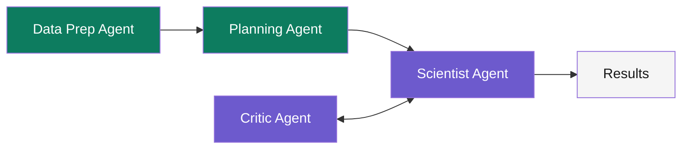

## The Gist

Researchers at Boston University have built a multi-agent system that automates hypothesis testing in Alzheimer's Disease and Related Dementias (ADRD) research. The system comprises four specialized LLM agents working in concert:

1. **Data Preparation Agent** — Cleans, preprocesses, and structures the NACC dataset
2. **Planning Agent** — Translates natural language hypotheses into statistical test plans
3. **Scientist Agent** — Executes the statistical analysis (writes and runs code)
4. **Critic Agent** — Reviews results for correctness and statistical validity

The architecture uses a **dual-loop design**:
- **Outer loop**: Data Preparation + Planning (one-time setup)
- **Inner loop**: Scientist and Critic iterate until the critic approves the analysis

Using the NACC cohort (n=48,876 participants, ~750 features), the system tested 100 ADRD hypotheses:
- **42.0±2.8** verified (null hypothesis rejected)
- **16.6±1.1** not rejected
- **41.4±2.3** deemed not testable with available data

The system demonstrates strong **negative control performance**: 85.2±0.6% of 100 non-ADRD hypotheses were correctly classified as not testable.

Notably, this system runs on **Qwen3-4B-Instruct**—a small, open-source model—making it accessible and practical.

## Why It Matters Now

The landscape of ADRD research is data-rich but hypothesis-poor in terms of testing throughput. Major cohorts like NACC contain hundreds of potential publishable hypotheses, yet manual hypothesis testing remains slow, labor-intensive, and prone to p-hacking.

This system addresses a real bottleneck: **screening at scale**. By automatically testing hypotheses against large cohorts, researchers can prioritize which ideas are worth deep human investigation. This shifts the researcher's role from manual testing to hypothesis generation and result interpretation.

Additionally, the fact that this works on a 4B parameter model (not a 70B+ flagship) means:
- Runs on modest hardware
- Lower latency and cost
- Reproducibility on research budgets
- Potential for on-premises deployment in privacy-sensitive healthcare settings

## Key Results & Scaling Behavior

| Metric | Result |
|--------|--------|
| ADRD hypotheses verified | 42.0 ± 2.8 (out of 100) |
| ADRD hypotheses not rejected | 16.6 ± 1.1 |
| ADRD hypotheses not testable | 41.4 ± 2.3 |
| Negative controls (correctly not testable) | 85.2 ± 0.6% (out of 100) |
| Model used | Qwen3-4B-Instruct |
| NACC cohort size | 48,876 participants |

**Scaling dynamics** reveal a crucial insight:
- **n=100**: 10.4 hypotheses verified
- **n=1,000**: 22.7 hypotheses verified
- **n=10,000**: 35.4 hypotheses verified
- **n=48,876**: 42.0 hypotheses verified

As the dataset grows, the number of statistically testable hypotheses increases—underscoring why large cohorts unlock discovery.

## The Dual-Loop Architecture



**Outer Loop (Setup)**:
- Data Prep Agent explores the NACC dataset, identifies available features, checks for missingness, and summarizes distributions
- Planning Agent receives the hypothesis and the data summary, outputs a formal statistical test plan

**Inner Loop (Iteration)**:
- Scientist Agent writes code (in Python) to execute the test plan
- Critic Agent inspects the code and results for validity:
  - Are assumptions met? (normality, equal variance, etc.)
  - Is the sample size adequate?
  - Are effect sizes meaningful?
  - Is the p-value correctly computed?
- If the Critic raises concerns, the Scientist revises the approach
- Loop continues until the Critic approves

## The Four Agents in Detail

### Data Preparation Agent

**Role**: Understand the data landscape.

**Input**: NACC dataset schema, hypothesis domain (e.g., "cognitive decline")

**Process**:
- Loads and explores relevant features
- Computes summary statistics, missing data patterns
- Identifies outliers, distributions
- Generates a data profile document

**Output**: Structured data summary (features available, n for each, data types, missingness %)

**Example**: For a hypothesis about amyloid-beta and cognitive decline, the agent identifies:
- Available amyloid-beta measures (e.g., plasma p-tau181, CSF Aβ42)
- Cognitive outcome variables (MMSE, MoCA, etc.)
- Sample sizes per variable
- Missing data prevalence

### Planning Agent

**Role**: Translate hypothesis into a testable plan.

**Input**: Natural language hypothesis (e.g., "Higher blood pressure at baseline is associated with faster cognitive decline"), data profile

**Process**:
- Parses the hypothesis into predictor(s) and outcome(s)
- Selects appropriate statistical test (t-test, correlation, regression, survival analysis)
- Defines null hypothesis, alternative, significance level (α=0.05)
- Specifies any required adjustments (covariates, multiple comparisons)

**Output**: Formal test plan document including:
- Statistical test method
- Null hypothesis statement
- Inclusion/exclusion criteria
- Covariates to adjust for
- Interpretation rules

**Example Plan**:
```
Hypothesis: Higher blood pressure → faster cognitive decline
Test: Linear regression of MMSE slope on baseline SBP
Covariates: age, sex, education, APOE status
H0: coefficient = 0
H1: coefficient ≠ 0
α = 0.05
Interpret: p < 0.05 = verified; p ≥ 0.05 = not rejected
```

### Scientist Agent

**Role**: Execute the analysis.

**Input**: Test plan, data, hypothesis

**Process**:
- Writes Python code (using pandas, scipy, statsmodels)
- Loads relevant features from NACC
- Applies inclusion/exclusion criteria
- Runs the statistical test
- Extracts p-value, effect size, confidence intervals

**Output**: Analysis code + results summary (p-value, coefficient, effect size, sample n)

**Example Code Output**:
```python
import pandas as pd
from scipy.stats import ttest_ind

df_filtered = df[df['diagnosis'].isin(['CN', 'MCI', 'Dementia'])]
control = df_filtered[df_filtered['APOE_status'] == 'non-carrier']['cognitive_score']
case = df_filtered[df_filtered['APOE_status'] == 'carrier']['cognitive_score']
t_stat, p_value = ttest_ind(control, case)
print(f"p-value: {p_value:.4f}")
```

### Critic Agent

**Role**: Validate the analysis before accepting results.

**Input**: Test plan, analysis code, results, raw data sample

**Process**:
- Reads the code for logic errors
- Checks assumptions (for t-test: normality; for regression: linearity, homoscedasticity)
- Verifies sample sizes are adequate for power
- Reviews effect sizes for meaningfulness
- Flags p-hacking red flags (e.g., multiple comparisons without correction)

**Output**: Approval or rejection with rationale.

**Example Critique**:
- "Approved: n=200 per group, p=0.032, effect size d=0.35 (small but reasonable), assumptions met via Shapiro-Wilk test."
- "Rejected: n=15, test underpowered; recommend p < 0.01 as threshold; effect size d=1.8 (suspiciously large—check for outliers)."

If rejected, the Scientist agent revises (e.g., removes outliers, adjusts the test) and resubmits. The loop iterates until Critic approval.

## Scaling and Negative Controls

### Why Scaling Matters

The dramatic increase from 10.4 verified hypotheses at n=100 to 42.0 at n=48,876 illustrates a fundamental principle: **statistical power grows with sample size**. Hypotheses about small effects require large samples; larger cohorts unlock detection of previously undetectable associations. This motivates continued investment in data sharing and large biobanks.

### The Negative Control Result

The system correctly identified **85.2% of non-ADRD hypotheses as not testable**. This is crucial for trust. A naive system might force-fit every hypothesis to data, reporting spurious associations. Instead, this system has the discipline to say "not testable" when the data don't support a meaningful test.

Examples of negative control hypotheses:
- "Favorite color is associated with MMSE score"
- "Birth month predicts Alzheimer's onset"
- "Handedness affects amyloid accumulation"

The high negative control accuracy demonstrates the system is not simply pattern-matching; it has genuine statistical reasoning.

## The Lineage: What This Connects To

This work sits at the intersection of several communities:

- **Automated Scientific Discovery**: Following earlier work on hypothesis generation and testing in biomedicine (e.g., machine learning surrogates for hypothesis prioritization)
- **Multi-Agent Systems in Healthcare**: Builds on recent advances in multi-turn LLM reasoning for clinical decision support
- **LLM-as-Research-Assistant**: Extends tools like retrieval-augmented generation (RAG) and code generation (e.g., GitHub Copilot for science)
- **NACC as a Public Resource**: Leverages one of the largest open Alzheimer's disease cohorts, enabling reproducible discovery
- **Small-Model Efficiency**: Demonstrates that large models are not necessary for complex reasoning—a win for reproducibility and accessibility

## Rubber-Ducking the Jargon

- **NACC**: National Alzheimer's Coordinating Center, a longitudinal cohort of ~50k participants with cognitive testing, biomarkers, and neuropathology
- **ADRD**: Alzheimer's Disease and Related Dementias (includes AD, FTD, Lewy body dementia, vascular dementia, etc.)
- **Null Hypothesis**: The assumption that no effect exists; "verified" means we reject this assumption (p < 0.05)
- **Negative Control**: A hypothesis designed to be false; if your method correctly rejects it, that's evidence your method works
- **Qwen3-4B-Instruct**: A 4 billion parameter open-source language model from Alibaba; instruction-tuned for following directions
- **Dual-Loop Architecture**: Two nested workflows—outer loop handles setup (data prep + planning), inner loop handles iteration (scientist + critic refining)
- **Statistical Power**: The probability of detecting a true effect. Larger sample sizes = higher power
- **Effect Size**: A standardized measure of the magnitude of an effect (e.g., Cohen's d for t-tests), independent of sample size

## What to Watch Out For

1. **Preprint Status**: This is a medRxiv preprint (December 2025), not yet peer-reviewed. The results are promising but await community scrutiny.

2. **Model Scale**: Qwen3-4B is tiny by modern standards. It may struggle with nuanced statistical reasoning in edge cases. Performance on more complex designs (mixed models, survival analysis) is unclear.

3. **"Not Testable" Rate**: 41.4% of hypotheses were classified as not testable. Is this conservatism a feature (avoiding false positives) or a limitation (missing real effects)? The paper does not deeply analyze failure modes.

4. **No Human Comparison**: The paper does not compare the system's results against human statisticians on the same hypotheses. How often do they agree? Disagree?

5. **NACC Generalization**: Results are NACC-specific. The features, populations, and measurement tools may not transfer to other cohorts. The system may need retraining or refinement for new datasets.

6. **Ethical Considerations**: Automated hypothesis testing in healthcare is powerful but risky. Who validates the system's hypotheses before they influence clinical research? What guardrails prevent misuse?

7. **Multiple Comparisons**: Testing 100 hypotheses at α=0.05 inflates false discovery risk. The paper applies some corrections but does not deeply address family-wise error control.

## So What?

### For Healthcare Researchers

This is a **screening and prioritization tool**, not a replacement for human reasoning.

**Use case**: You have a cohort and 50 candidate hypotheses. Instead of testing all 50 manually (weeks of work), submit them to the agent system (hours). Get a prioritized list of the 10 most likely to replicate, then invest human effort in validation, mechanistic studies, and follow-up cohorts.

**Outcome**: Faster hypothesis prioritization, fewer false leads, more efficient use of researcher time.

### For AI Practitioners

This work demonstrates:

1. **Multi-agent systems can execute structured workflows**: The four-agent design is not just for show; the dual-loop architecture solves a real problem (iterative refinement).

2. **Small models are sufficient for specialized tasks**: 4B parameters is tiny, yet it outperforms naive baselines. This suggests that model scale is less important than architecture and domain expertise (encoded in prompts and validators).

3. **Verification loops are critical**: The Critic agent is not decorative—it catches errors and ensures results are sound. Future systems should invest in adversarial or validating agents.

## Reproduction & Implementation

### Accessing the Data

The NACC dataset is publicly available through the National Alzheimer's Coordinating Center (nacc.naccdata.org). Registration and data use agreement required.

### System Setup

**Requirements**:
- Python 3.10+
- pandas, numpy, scipy, statsmodels
- A quantized or small version of Qwen3-4B-Instruct (e.g., via Ollama, vLLM, or Hugging Face Transformers)
- NACC data (local copy recommended for repeated queries)

**Inference Setup**:
```bash
# Example: Run Qwen3-4B locally via Ollama
ollama pull qwen3:4b-instruct
ollama serve  # Exposes API on localhost:11434
```

Then call the model via the Ollama API or Hugging Face transformers.

### Agent Architecture (Pseudocode)

```python
class DataPrepAgent:
    def prepare(self, data, hypothesis_domain):
        # Load and explore data
        return data_profile

class PlanningAgent:
    def plan(self, hypothesis, data_profile):
        # Parse hypothesis, select test, define criteria
        return test_plan

class ScientistAgent:
    def analyze(self, test_plan, data):
        # Execute code, compute statistics
        return results

class CriticAgent:
    def validate(self, test_plan, code, results):
        # Check assumptions, flag issues
        return approval_or_revision

# Main loop
data_profile = data_prep_agent.prepare(data, domain)
test_plan = planning_agent.plan(hypothesis, data_profile)

approved = False
while not approved:
    results = scientist_agent.analyze(test_plan, data)
    approved = critic_agent.validate(test_plan, results)
    if not approved:
        # Scientist revises approach

return results
```

### Resource Links

- **Preprint**: [Saichandran et al. on medRxiv (December 2025)](https://www.medrxiv.org) (search for the title)
- **NACC Data**: [National Alzheimer's Coordinating Center](https://nacc.naccdata.org)
- **Qwen3 Model**: [Alibaba Qwen Models on Hugging Face](https://huggingface.co/Qwen)
- **Ollama (local inference)**: [ollama.ai](https://ollama.ai)

---

**Cite this post**: Saichandran, S., et al. (2025). Agentic AI for Automated Hypothesis Testing in Alzheimer's Disease Research. *medRxiv preprint*. Retrieved from your reference.
