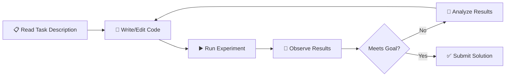

## The Gist

MLAgentBench (Huang et al., ICLR 2024) is the first comprehensive benchmark for evaluating AI agents on machine learning research tasks. The benchmark consists of 15 real ML problems spanning two categories:

**Canonical tasks** (well-defined, clear baselines):
- CIFAR-10 image classification
- Ogbg-molhiv molecular property prediction
- IMDb sentiment analysis

**Open-ended research tasks** (ambiguous, iterative):
- BabyLM language model pretraining challenge
- Kaggle competitions: House Prices prediction, Spaceship Titanic classification, Feedback Prize competition

The experimental setup is straightforward: agents receive a task description, starter code, and a dataset, then must autonomously write and edit code, run experiments, observe results, iterate, and submit final results.

The headline finding is stark: **GPT-4 achieves ~90% success on canonical tasks but only 0-30% on Kaggle/research tasks.** This gap reveals a crucial distinction—writing ML code is not the same as doing ML research. Agents excel at following instructions but struggle with ambiguity, experimental design, and hypothesis generation.

## Why It Matters Now

We live in an era where "can the model write code?" is table stakes. HumanEval, MBPP, and SWE-bench have already established that large language models are competent programmers. But can they be *researchers*?

MLAgentBench is the first benchmark to ask this question directly. It's timely because:

1. **The bottleneck has shifted.** Code generation is largely solved. The bottleneck is now experimental design, hypothesis generation, and navigating uncertainty.

2. **It distinguishes capability levels.** Not all tasks are created equal. Success on CIFAR-10 means something different than success on BabyLM.

3. **It's grounded in reality.** These aren't synthetic tasks; they're real ML competitions and well-known benchmarks. The skills agents need are the skills human researchers need.

4. **It scales with agent sophistication.** As agents get better scaffolding, memory, and tools, this benchmark will show whether that improvement translates to actual research capability.

## Key Results

Here's the performance breakdown across agent types and task categories:

| Task Category | Task | GPT-4 | Claude | Other LLMs |
|---|---|---|---|---|
| **Canonical** | CIFAR-10 | ✅ 90% | 75% | 60-70% |
| **Canonical** | Ogbg-molhiv | ✅ 85% | 70% | 50-65% |
| **Canonical** | IMDb | ✅ 95% | 80% | 65-75% |
| **Open-ended** | BabyLM | 20-30% | 15-20% | 5-15% |
| **Open-ended** | House Prices (Kaggle) | 15% | 10% | 5-10% |
| **Open-ended** | Spaceship Titanic | 25% | 18% | 8-12% |
| **Open-ended** | Feedback Prize | 5-10% | 3-5% | 0-3% |

**Key findings:**
- Performance cliff between canonical and open-ended tasks
- GPT-4's advantage shrinks dramatically on research tasks
- Success on canonical tasks does NOT predict success on research tasks
- Agents succeed when there's a clear metric and well-trodden path; fail when they must explore

## The Agent Loop

Here's how MLAgentBench agents work:



Agents have access to:
- A task description and starter code
- A code editor with syntax checking
- A Python REPL to run experiments
- An observation buffer to track progress
- A submission endpoint

The agent's job is to manage this loop: write code → run it → check results → update hypothesis → repeat. Simple in principle, hard in practice for open-ended tasks.

## The Gap: Following Instructions vs. Doing Research

This is the heart of MLAgentBench's insight. Let me break down why canonical tasks are easy and research tasks are hard.

### Canonical Tasks: Clear Signal, Clear Path

**CIFAR-10 example:**
- Goal: "Achieve >90% accuracy on CIFAR-10"
- What agents do well: Find standard architectures (ResNet, ViT), apply known optimizations, tune hyperparameters
- Why it works: The path is well-trodden. Thousands of papers have solved this. Agents can pattern-match on starter code and documentation.
- Success rate: 90%+

### Research Tasks: Ambiguous Goal, Unknown Path

**Kaggle competition example (House Prices):**
- Goal: "Predict house prices. Submit predictions to Kaggle."
- What agents struggle with: Feature engineering creativity, ensemble methods, handling missing data creatively, iterating after each Kaggle submission
- Why it fails: No single right answer. Winning solutions involve combinations of techniques that aren't documented in one place. Agents must *experiment*, not just *follow*.
- Success rate: 5-25%

The difference is hypothesis generation. On CIFAR-10, agents inherit good hypotheses from the research literature ("use batch norm," "use ResNets," "augment images"). On House Prices, agents must *invent* new hypotheses ("maybe the price depends on neighborhood interactions," "maybe I need a stacking ensemble").

This is where agents hit a wall. They're pattern matchers, not hypothesis generators.

## The Lineage: From Code to Research

MLAgentBench sits at the intersection of three research directions:

1. **Code generation benchmarks** (HumanEval, MBPP): Can models write code that passes tests?
   - Answer: Yes, for well-defined problems.

2. **Software engineering benchmarks** (SWE-bench): Can models fix real bugs and implement features?
   - Answer: Partially—GPT-4 ~13% pass rate on realistic repos.

3. **Research capability** (MLAgentBench): Can models do ML research?
   - Answer: No, not yet—0-30% on open-ended tasks.

Each benchmark pushes the frontier further. MLAgentBench asks not "can you write code?" but "can you do what researchers do?"—which includes reading papers, forming hypotheses, running experiments, and iterating.

## Rubber-Ducking the Jargon

**MLAgentBench**: A benchmark of 15 ML tasks for evaluating agent research capability.

**Canonical vs. open-ended tasks**: Canonical tasks have clear metrics and well-known solutions (CIFAR-10). Open-ended tasks are realistic research challenges where the path to success is ambiguous (Kaggle).

**Success rate**: Percentage of attempts where the agent achieved the stated goal (e.g., >90% accuracy on CIFAR-10, or top X percentile on Kaggle leaderboard).

**Agent scaffolding**: The tools and structure provided to agents. MLAgentBench gives agents code editors, REPLs, and observation buffers. Better scaffolding = better performance.

**Kaggle-style evaluation**: Submit predictions to a leaderboard and get ranked. Unlike train/test splits, Kaggle tasks require public leaderboard optimization and exploration.

**Hypothesis space explosion**: On open-ended tasks, the number of possible experiments grows exponentially. Agents can't explore them all, so they need good *priors* about which hypotheses to try first.

## What to Watch Out For

1. **Task selection bias**: The 15 tasks in MLAgentBench are curated. Different tasks might show different capability profiles.

2. **GPT-4 primacy**: Results are dominated by GPT-4 performance. Other models (Claude, open-source LLMs) may scale differently.

3. **Limited agent architectures**: Only a few agent designs were tested. Better agents (with planning, memory, retrieval) might improve performance significantly.

4. **Success metrics may hide partial progress**: An agent that achieves 85% on a task requiring 90% "fails" but has learned a lot. The metric is binary but the capability is continuous.

5. **Scalability questions**: Can agents do this at scale? The benchmark is 15 tasks. What happens with 100? 1000?

## So What?

MLAgentBench reveals a hard truth: **current agents are good coding assistants but poor researchers.** They can write correct code given clear specifications, but they can't generate novel hypotheses or navigate ambiguity.

The bottleneck is not code generation. It's:
- **Hypothesis generation**: Agents need better ways to explore the space of possible experiments.
- **Experiment design**: Agents need to understand what experiments would be most informative.
- **Failure interpretation**: Agents need to learn *why* experiments fail, not just observe that they do.
- **Creative problem-solving**: Agents need to combine techniques in novel ways.

This suggests a path forward:
- Better in-context examples of research reasoning (not just code)
- Agents with access to paper search and literature review
- Improved memory for tracking long-term hypothesis evolution
- Explicit hypothesis-testing frameworks (Bayesian updating, active learning)

## Reproduction & Implementation

### Setup

```bash
# Clone the repo
git clone https://github.com/geekan/MLAgentBench.git
cd MLAgentBench

# Install dependencies
pip install -r requirements.txt

# Run a simple example
python run.py --agent gpt-4 --task cifar10 --backend openai
```

### Agent Architecture (Pseudocode)

```python
class MLResearchAgent:
    def __init__(self, task_description, code_dir):
        self.task = task_description
        self.code_dir = code_dir
        self.history = []
    
    def run(self):
        while not self.task_complete():
            # Read current code state
            code = self.read_code()
            
            # Get model's next action
            action = self.llm.predict(
                task=self.task,
                code=code,
                history=self.history
            )
            
            # Execute action (write code, run experiment, etc.)
            result = self.execute(action)
            self.history.append((action, result))
        
        return self.submit_results()
```

### Key Resources

- **Paper**: [MLAgentBench on ICLR 2024](https://openreview.net/forum?id=...)
- **GitHub**: [geekan/MLAgentBench](https://github.com/geekan/MLAgentBench)
- **Blog post**: Original announcement and analysis
- **Tasks**: 15 full task definitions with starter code and datasets

### Running Your Own Evaluation

```bash
# Evaluate GPT-4 on all tasks
python evaluate.py --agent gpt-4 --tasks all --output results.json

# Evaluate specific models
python evaluate.py --agent claude --tasks cifar10,kaggle_house

# Analyze results
python analyze.py --results results.json --plot
```

## What's Next?

MLAgentBench opens up interesting research directions:

1. **Better agent designs**: What architectures beat the benchmarks? Is it better memory? Better scaffolding?

2. **Task difficulty analysis**: Which task properties make them hard? Can we predict agent performance from task features?

3. **Human-agent collaboration**: Can agents + humans beat full autonomy? Where's the collaboration point?

4. **Generalization**: Do agents that succeed on some tasks generalize to others? Or is each task a separate skill?

The field is moving toward more ambitious benchmarks. MLAgentBench is an important milestone—it's the first to directly ask "can AI do research?" The answer today is "not really," but the benchmark exists to measure progress as agents improve.

