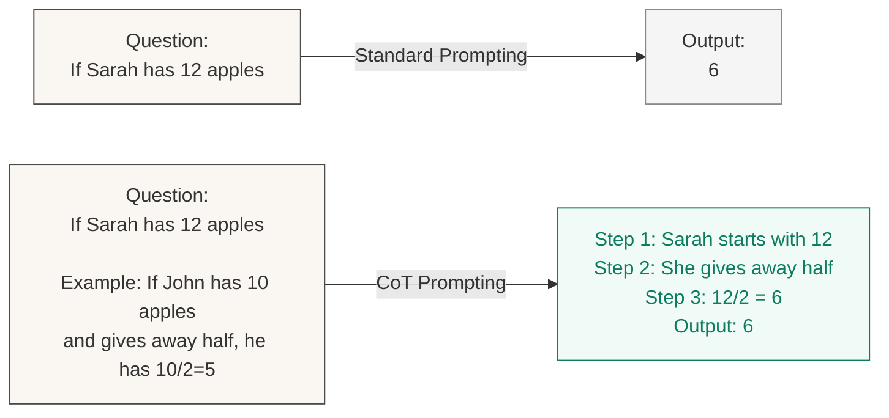

## The Gist

What if you could get a language model to solve harder problems just by asking it to "think out loud"? That's the elegantly simple insight behind **chain-of-thought (CoT) prompting**, demonstrated in Wei et al.'s NeurIPS 2022 paper. Instead of asking a model "What is 15% of 40?" and expecting the answer directly, you show it a few examples where the answer comes *after* the reasoning: "15% of 40. 40 × 0.15 = 6." Then the model learns to do the same—walking through the problem step by step before committing to an answer.

The results are striking. On the **GSM8K** benchmark (grade-school math word problems), PaLM 540B jumped from 17.9% accuracy with standard prompting to 57.1% with chain-of-thought—a near 3× improvement and new state-of-the-art at the time of publication. Similar gains appear across arithmetic reasoning, commonsense question-answering, and symbolic manipulation tasks. Crucially, this required no fine-tuning, no retraining, no new model weights—just a change in how you ask the question.

Here's the plot twist: the technique only works at scale. Below roughly 100 billion parameters, chain-of-thought prompting produces nonsensical chains and often *hurts* performance. This emergent behavior—where a capability suddenly appears in larger models—became a defining question in AI research and hinted that reasoning is latent in large language models, waiting to be unlocked by the right prompt structure.

## Why It Matters Now

In early 2022, the prevailing wisdom was that language models were pattern-matchers, good at text generation and retrieval but fundamentally limited for multi-step reasoning. This paper upended that narrative. It showed, rigorously and reproducibly, that prompting alone—without architectural changes or training—could elicit reasoning behaviors in large models.

This single finding launched an entire research direction. Self-Consistency (Wang et al., 2022) followed weeks later, showing that sampling multiple CoT chains and taking the majority answer further improves performance. Tree-of-Thought (Yao et al., 2023) extended the idea to explore branching reasoning paths. ReAct (Shunevo et al., 2023) combined reasoning with interleaved actions. Prompt-as-Program (Gu et al., 2023) and other work explored how to structure reasoning more explicitly. By 2024, chain-of-thought reasoning was standard practice for any hard task—you simply wasn't asking your LLM correctly if you weren't asking for step-by-step reasoning.

The deeper significance: this paper provided empirical evidence that large language models contain latent reasoning capabilities. The models weren't learning to reason *from* the chain-of-thought examples; they were already capable of reasoning, and the examples just showed them that reasoning was expected. That distinction shifted how researchers thought about model capabilities—not as fixed skills to be discovered but as latent potential to be elicited through the right interface.

## Key Results

The improvements span multiple domains and benchmarks:

| Benchmark | Task Type | Standard | Chain-of-Thought | Model |
|-----------|-----------|----------|------------------|-------|
| **GSM8K** | Arithmetic word problems | 17.9% | 57.1% | PaLM 540B |
| **SVAMP** | Solving word arithmetic problems | 69.4% | 79.0% | PaLM 540B |
| **ASDiv** | Arithmetic story division | 73.9% | 79.0% | PaLM 540B |
| **AQuA** | Algebra question answering | 25.2% | 35.8% | PaLM 540B |
| **CommonsenseQA** | Commonsense reasoning | 75.5% | 77.1% | PaLM 540B |
| **StrategyQA** | Multi-hop commonsense | 65.4% | 73.4% | PaLM 540B |

The largest gains appear on arithmetic tasks (GSM8K: +39.2 points), where step-by-step reasoning is most directly applicable. Even on commonsense tasks where exact computation isn't required, CoT provides consistent improvements. Across diverse model sizes and architectures, the pattern held: bigger models benefit more, and models below ~100B parameters see minimal or negative gains.

## Process Visualization

Here's how chain-of-thought prompting changes the interaction:



The standard path (top) asks for an answer directly. The chain-of-thought path (bottom) shows the model an example with reasoning included, then lets the model follow the same pattern—**expressing intermediate steps before the final answer**. The model learns to mirror this structure, and in doing so, its accuracy dramatically improves.

## The Emergence Story

One of the paper's most important findings is the **scaling threshold**: chain-of-thought prompting doesn't help at all model sizes. The researchers tested models ranging from 1 billion to 540 billion parameters and found a striking pattern:

- **Models below ~100B parameters**: CoT prompting either made things worse or provided negligible improvement. The models generated plausible-sounding but nonsensical reasoning chains.
- **Models at 100B+ parameters**: CoT prompting provided dramatic and consistent improvements.
- **PaLM 540B (largest tested)**: Achieved the largest absolute improvements.

This is an **emergent ability**—a capability that suddenly appears at scale rather than improving gradually. It suggests that at smaller scales, models lack the capacity to reliably generate useful intermediate reasoning steps, or the reasoning isn't properly aligned with the final answer. But somewhere in the 100B+ regime, models develop the ability to express reasoning in ways that are both plausible and useful.

This finding has profound implications. It means:
1. **Reasoning isn't explicitly taught**—models learn it from scale and pretraining alone.
2. **The interface matters as much as the weights**—how you ask determines what capability you unlock.
3. **There may be other emergent capabilities waiting**—if reasoning is latent at scale, what else is?

The emergence pattern became a major research focus in subsequent years, leading to work on mechanistic interpretability, capability evaluations at scale, and questions about what hidden skills live inside large models.

## The Lineage: Where This Fits

Chain-of-thought prompting didn't emerge from nowhere. It builds on:

- **Few-shot prompting (Brown et al., 2020, GPT-3)**: The observation that language models can learn task structure from examples in the prompt itself, without any fine-tuning.
- **Scratchpad and intermediate reasoning work**: Prior hints that models benefit from working space to write down intermediate computations.

And it inspired a lineage of follow-on work:

- **Self-Consistency (Wang et al., 2022)**: Sample multiple CoT paths, take the majority vote answer—further improvements without new models.
- **Tree-of-Thought (Yao et al., 2023)**: Generalize CoT to explore multiple reasoning branches, not just a single linear chain.
- **ReAct (Shunevo et al., 2023)**: Interleave reasoning with actions (API calls, searches), enabling agents.
- **Prompt-as-Program (Gu et al., 2023)**: Structure reasoning more explicitly using pseudo-code or domain-specific languages.
- **Graph-of-Thought & other variants**: Further refinements on the basic idea of making reasoning explicit.

By 2024, the assumption is reversed: you should ask for reasoning first, then see if you need anything else. "Show your work" became the default best practice.

## Rubber-Ducking the Jargon

- **Chain-of-thought (CoT) prompting**: The practice of providing examples (in the prompt itself) that show intermediate reasoning steps before the final answer, teaching the model to do the same.
  
- **Few-shot prompting**: Providing a small number of task examples in the prompt, allowing the model to infer the task structure without any gradient-based learning.

- **Greedy decoding**: Generating text one token at a time by always picking the highest-probability token. (The alternative, sampling, picks randomly from the probability distribution.)

- **Emergent ability**: A capability that appears sharply at a particular model scale rather than improving gradually as models get larger. Reasoning via CoT is one of the clearest examples.

- **Arithmetic reasoning benchmarks**: Datasets like GSM8K (grade-school math), SVAMP (solving word arithmetic problems), and ASDiv (arithmetic story division) that test a model's ability to solve math word problems.

- **Exemplars**: The example task instances shown in the prompt. "Few-shot" means "a few exemplars." "Zero-shot" means no exemplars, just instructions.

## What to Watch Out For

Chain-of-thought is powerful, but it has limits:

1. **Scale dependency**: The technique requires large models (100B+ parameters). On smaller models or fine-tuned variants, gains may be minimal or negative.

2. **Correct chains ≠ correct reasoning**: A model can generate a plausible reasoning chain that leads to the wrong answer. The chain looks like reasoning, but it's not *sound* reasoning—it's pattern matching on reasoning-like structure.

3. **Benchmark specificity**: Most gains have been measured on arithmetic and structured reasoning tasks. Performance on open-ended or creative tasks is less studied.

4. **Exemplar annotation cost**: While no fine-tuning is required, creating good CoT exemplars still requires human annotation—someone needs to write out the reasoning steps for the few-shot examples.

5. **Faithfulness questions**: When a model generates a reasoning chain, is that chain the actual "reasoning" the model used, or is it post-hoc rationalization? This remains an open question in interpretability research.

6. **Generalization beyond training**: CoT helps on benchmarks similar to the exemplars, but transferring to novel problem types is still an open challenge.

## So What?

For practitioners:

1. **Always ask for reasoning**: If your task requires multi-step logic, include examples of step-by-step reasoning in your prompt. It's free (no retraining), and it often works.

2. **Design exemplars carefully**: The quality of your few-shot examples matters. Show diverse reasoning patterns, not just the "right" answer.

3. **Combine with other techniques**: CoT pairs well with Self-Consistency (multiple samples), retrieval-augmented generation (RAG), and tool use. Don't stop at CoT; it's a building block.

4. **Test at your scale**: If you're using smaller models (<100B), validate that CoT actually helps before relying on it. The scaling threshold is real.

5. **Keep interpreting chains with skepticism**: A well-written chain of reasoning is suggestive, but not proof. For high-stakes decisions, treat the chain as an explanation artifact, not ground truth.

## Reproduction & Implementation

### Environment Setup

```python
# Install dependencies for using large language models
pip install transformers torch datasets evaluate

# Or for API-based access:
pip install openai  # for GPT models
pip install google-generativeai  # for Gemini
```

### Standard vs. Chain-of-Thought Prompt Format

**Standard prompt:**
```markdown
Q: If there are 3 cars in the parking lot and 2 more arrive, how many are there now?
A: 5
```

**Chain-of-thought prompt (few-shot example):**
```markdown
Q: If there are 3 cars in the parking lot and 2 more arrive, how many are there now?
A: We start with 3 cars. 2 more arrive. 3 + 2 = 5. There are 5 cars now.

Q: Sarah has 12 apples. She gives half to her friend. How many does she have left?
A: Sarah starts with 12 apples. She gives half away, which is 12 / 2 = 6. So she gives away 6 and has 12 - 6 = 6 left.
```

The model sees the pattern and generates reasoning before the answer.

### CoT Evaluation Pipeline (Pseudo-code)

```python
def evaluate_with_cot(model, test_set, exemplars):
    """
    Evaluate a model on a test set using chain-of-thought prompting.
    
    Args:
        model: Language model (OpenAI API, HF transformer, etc.)
        test_set: List of {question, correct_answer} dicts
        exemplars: List of CoT examples to include in prompt
    
    Returns:
        accuracy: Fraction of correct answers
    """
    correct = 0
    
    for question, correct_answer in test_set:
        # Build prompt with few-shot CoT examples
        prompt = "You are a helpful assistant. Solve the following problem step-by-step.\n\n"
        for example in exemplars:
            prompt += f"Q: {example['question']}\n"
            prompt += f"A: {example['reasoning']}\n\n"
        prompt += f"Q: {question}\nA:"
        
        # Generate response
        response = model.generate(prompt)
        
        # Extract answer (simple approach: last number in response)
        predicted_answer = extract_final_answer(response)
        
        if predicted_answer == correct_answer:
            correct += 1
    
    accuracy = correct / len(test_set)
    return accuracy


def extract_final_answer(text):
    """Extract numeric answer from model output."""
    # Simple: find last number in text
    import re
    numbers = re.findall(r'\d+', text)
    return int(numbers[-1]) if numbers else None
```

### Key Resources

- **Paper**: [Chain-of-Thought Prompting Elicits Reasoning in Large Language Models](https://arxiv.org/abs/2201.11903) (arXiv:2201.11903)
- **Benchmark (GSM8K)**: [Grade School Math 8K](https://huggingface.co/datasets/openai/gsm8k) on Hugging Face
- **Related work (Self-Consistency)**: [Self-Consistency Improves Chain of Thought Reasoning in Language Models](https://arxiv.org/abs/2203.11171)
- **PaLM model**: [PaLM: Scaling Language Modeling with Pathways](https://arxiv.org/abs/2204.02311)

## Further Exploration

If you found this interesting, consider exploring:

- **Self-Consistency**: Sampling multiple CoT chains and voting on the answer—often achieves better accuracy than a single chain.
- **Tree-of-Thought**: Expanding the linear chain into a tree structure, exploring multiple reasoning branches.
- **Interpretability of chains**: Do the reasoning chains reflect actual model computation, or are they post-hoc rationalizations? See work by Chen et al. on faithfulness.
- **CoT in code generation**: How does chain-of-thought prompting help with programming tasks? See papers on code reasoning and complex task decomposition.
