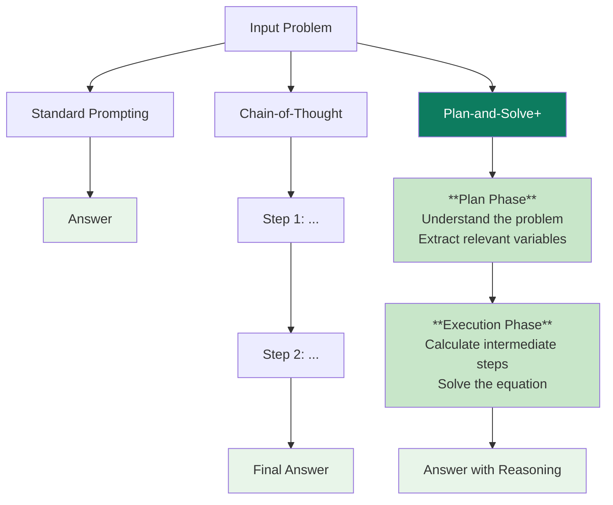

## The Gist

Chain-of-thought (CoT) prompting has become a go-to technique for getting language models to reason through problems step-by-step. But it still fails in surprisingly predictable ways.

Wang et al.'s **Plan-and-Solve (PS+) prompting** identifies three systematic failure modes in zero-shot CoT:

1. **Missing-step errors**: The model skips intermediate computations and produces hallucinated intermediate values
2. **Semantic misunderstanding**: The model misinterprets what the problem is actually asking
3. **Calculation errors**: Arithmetic mistakes in the execution phase

The fix? Rather than asking the model to "think step by step," PS+ prompts it to:

- **First devise a plan** to understand the problem and extract relevant variables
- **Then execute that plan** with explicit instructions to calculate each intermediate step
- Use concrete, structured prompts rather than open-ended ones

Using GPT-3 text-davinci-003, PS+ achieves **76.7% on arithmetic reasoning** versus 70.4% for Zero-shot-CoT—a solid improvement without fine-tuning or few-shot examples.

## Why It Matters Now

This paper represents a shift from "just add reasoning" to **structured, explicit reasoning prompts**. Three reasons this matters:

1. **Prompt engineering as problem-solving**: Shows that careful prompt design can compensate for model limitations without fine-tuning or scaling
2. **Bridges a gap**: Demonstrates that you can get close to few-shot performance with zero-shot methods—useful when examples are hard to find
3. **Foundation for agent architectures**: The separation of planning and execution is a pattern you'll see recurring in agent systems and tool use

It also shows that LLM reasoning failures aren't just "the model being dumb"—they're systematic, and systematic problems have systematic solutions.

## Key Results

### Arithmetic Reasoning

| Benchmark | Zero-shot-CoT | PS+ | Gain |
|-----------|---------------|-----|------|
| **Average** | 70.4% | 76.7% | +6.3pp |
| MultiArith | 83.8% | 92.2% | +8.4pp |
| GSM8K | 56.4% | 58.7% | +2.3pp |
| SVAMP | 70.8% | 76.2% | +5.4pp |
| MathQA | 71.3% | 81.2% | +9.9pp |

The largest gains come on MultiArith (fraction and word problems), where planning and step-by-step execution matter most.

### Commonsense Reasoning

| Benchmark | Zero-shot-CoT | PS+ |
|-----------|---------------|-----|
| **Average** | 75.5% | 76.9% |
| CommonsenseQA | 80.3% | 81.6% |
| StrategyQA | 71.2% | 72.8% |

Gains are modest here—commonsense often doesn't benefit as much from explicit planning, but PS+ doesn't hurt.

### Symbolic Reasoning

Mixed results. PS+ helps on some symbolic tasks (e.g., last-letter concatenation) but not others, suggesting the approach works best when intermediate computation matters.

## The Prompting Pipeline

Here's how the three approaches differ:



The key difference: PS+ explicitly asks the model to **separate understanding from execution**.

## The Three Pitfalls in Detail

### 1. Missing-Step Errors

The model computes wrong intermediate values because it skips steps.

**Example (SVAMP problem):**
> "Sarah had 5 apples. John gave her some more. Now she has 8. How many did John give her?"

**Zero-shot-CoT might output:**
> "Sarah had 5 apples. John gave her apples. She has 8 apples. So John gave her 8 apples."

It skipped the subtraction (8 - 5 = 3). The model jumped to an answer without showing intermediate computation.

**PS+ fix:** Explicitly ask to "Calculate the difference between the final and initial amounts."

### 2. Semantic Misunderstanding

The model misinterprets the problem structure.

**Example:**
> "A restaurant has 3 tables. Each table seats 4 people. How many people can it seat?"

**Zero-shot-CoT might interpret this as:** "Add 3 and 4" or "Subtract 3 from 4" because it doesn't grasp that this is a multiplication problem.

**PS+ fix:** First ask "What are the relevant quantities?" (tables, people per table), then ask "What operation should we use?" before computing.

### 3. Calculation Errors

The model makes arithmetic mistakes even when it knows what to compute.

**Example:** Correctly identifying that you need to compute 23 × 17, but outputting 381 instead of 391.

**PS+ fix:** Ask the model to "Show intermediate calculations" or even "Verify your answer." The explicit pressure to compute carefully reduces careless errors.

## The Lineage

This work sits in a specific genealogy:

- **Wei et al. (2022): Chain-of-Thought Prompting** — The foundational insight that asking for reasoning improves performance
- **Kojima et al. (2022): Zero-shot-CoT** — "Let's think step by step" as a universal trigger (this paper's baseline)
- **Wang et al. (2023): Plan-and-Solve** — Structure that baseline with planning and extraction (this paper)
- **Later work**: Leads toward **program synthesis** (generating executable code instead of natural language), **self-verification** (having the model check its own work), and **agent architectures** with explicit planning modules

Each step makes prompting less magical and more engineering-like.

## Rubber-Ducking the Jargon

- **Zero-shot-CoT**: Prompting for reasoning without providing examples
- **Few-shot**: Providing a few examples before asking the question
- **PS vs PS+**: PS is the planning-only version; PS+ adds execution guidance
- **text-davinci-003**: GPT-3's instruction-tuned variant used in this work (larger models like GPT-4 have superseded it)
- **Semantic misunderstanding**: The model "understands" the words but misunderstands the logical structure
- **Intermediate values**: The computed quantities you need before reaching the final answer (e.g., "John gave 3 apples" is intermediate; "Sarah now has 8 apples" is the answer)

## What to Watch Out For

1. **Single model tested**: Only evaluated on text-davinci-003. Larger models (GPT-4) may have lower baseline errors, reducing the gap PS+ can close

2. **Benchmark-specific gains**: The gains vary wildly. Arithmetic reasoning loves structure. Commonsense barely benefits. Your task may differ

3. **Prompt sensitivity**: These prompts need to be carefully written. A small change in wording can hurt performance. This is fragile

4. **The gap between PS and PS+**: The original PS (planning only) significantly underperforms PS+ (planning + execution guidance), suggesting the approach is brittle and requires both components

5. **No few-shot comparison**: The paper compares zero-shot-CoT vs PS+, but not PS+ vs few-shot-CoT with good examples. Few-shot might still be better

6. **Doesn't solve all categories**: Symbolic reasoning shows mixed results. If your task is abstract symbol manipulation, this approach may not help

## So What?

**Practically speaking:**

When you're using a model for reasoning without fine-tuning:

- **Don't just say** "Let's think step by step"
- **Do say** "First, let's understand the problem and identify the relevant variables. Then, let's solve it step by step, computing each intermediate result."

When designing prompts:

- Structure them to separate **understanding** (what is the problem?) from **execution** (how do we solve it?)
- Ask the model to **extract variables** before computing
- Force **intermediate reasoning** rather than jumping to answers

This is especially valuable for:
- Math and logic problems
- Multi-step planning tasks
- Situations where you can't provide few-shot examples
- When you're trying to squeeze better performance out of a model you can't fine-tune

## Reproduction & Implementation

### Quick Start

**Zero-shot-CoT prompt:**
```
Let's think step by step.
[Problem]
```

**PS+ prompt:**
```
Let's understand the problem:
[Problem]
What are the relevant variables?
What equations or relationships do we need?

Let's devise a plan:
[Ask model to outline steps]

Now let's solve it step by step:
[Model works through each step with explicit calculations]
```

### Pseudocode Structure

```python
def ps_plus_solve(problem: str, model) -> str:
    # Phase 1: Understanding
    understanding = model.complete(
        f"Understand this problem and extract relevant variables:\n{problem}"
    )
    
    # Phase 2: Planning
    plan = model.complete(
        f"Based on this understanding:\n{understanding}\n\nDevise a step-by-step plan to solve it"
    )
    
    # Phase 3: Execution
    solution = model.complete(
        f"Plan:\n{plan}\n\nNow execute this plan, showing all intermediate calculations:\n"
    )
    
    return solution
```

### Key Insights for Implementation

1. **Separate prompts often work better** than one mega-prompt (allows better token budget allocation)
2. **Explicit instruction to "show calculations"** matters more than you'd expect
3. **Temperature can matter**: Lower temp (0.0-0.3) for reasoning, slightly higher (0.5-0.7) for creative planning
4. **Don't be afraid to iterate**: These prompts aren't one-shot. Test variants on your own problems

## Links & References

- **ACL 2023 paper**: [Plan-and-Solve Prompting: Improving Zero-shot Chain-of-Thought Reasoning by Large Language Models](https://aclanthology.org/2023.acl-main.507/)
- **arXiv**: [2305.04091](https://arxiv.org/abs/2305.04091)
- **Authors**: Lei Wang, Wanyu Huang, Yushun Dong, Yilun Zhao, Yali Du, Edward Y. Chang, Benyou Wang
- **Related work**:
  - [Wei et al. (2022): Chain-of-Thought Prompting](https://arxiv.org/abs/2201.11903)
  - [Kojima et al. (2022): Large Language Models are Zero-Shot Reasoners](https://arxiv.org/abs/2205.11916)
  - [Nye et al. (2021): Show Your Work](https://arxiv.org/abs/2010.03537)
